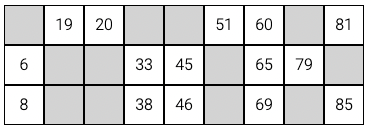

# Bingo ticket generator

Creating standard bingo tickets using HTML5, CSS3 and JavaScript

## Objective

The main focus of this project is to create a function that returns an object with 15 numbers with the following conditions:

* Each number must be unique
* Each number must be included between 1 and 90
* There must be at least one number selected from each group of 10 (1-9,10-19,...,80-90)
* The numbers must be displayed in a table of 9 columns and 3 rows, where columns represent groups of 10 and can have minum 1 and maximum 3 numbers, and rows mus have 5 numbers as the following example:

## Skills and technical aspects to focus on

* Manipulating DOM elemtents through JavaScript
* Using objects, arrays, functions and loops
* Practicing on algorithms

## Links

[Explore the project](https://www.theodhorshyti.com)

